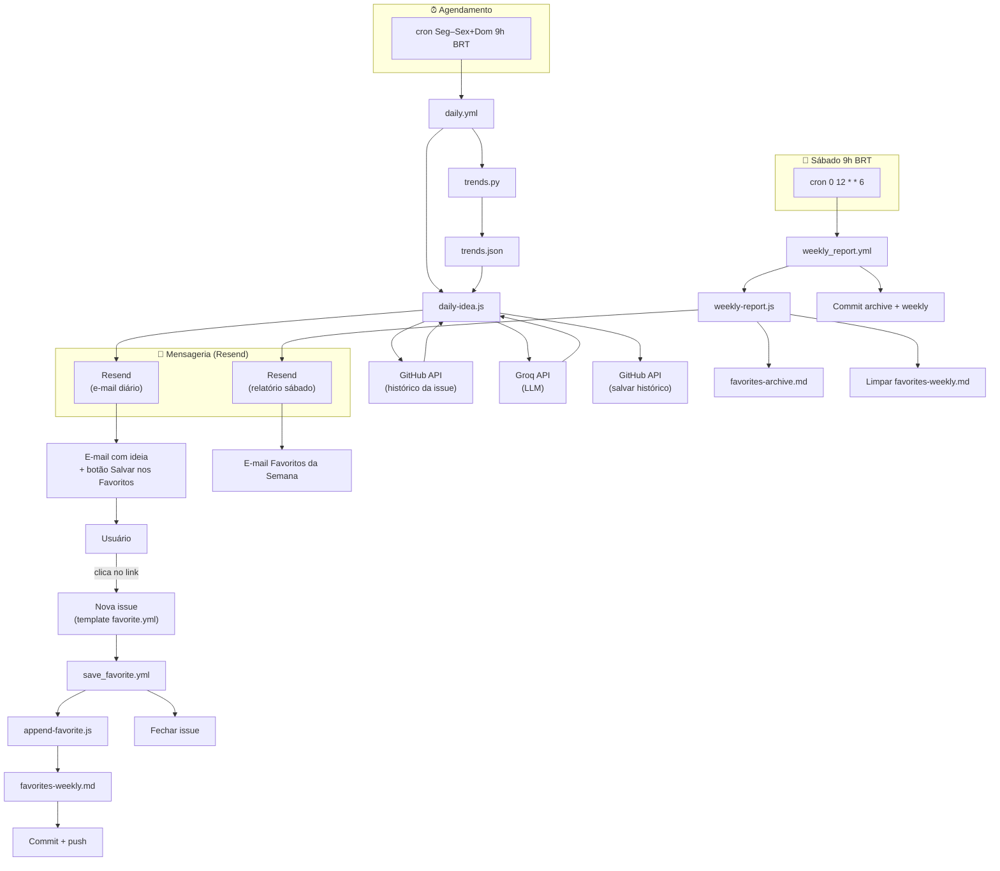

# Ideia de Conteúdo Diária

Sistema que roda diariamente via **GitHub Actions**, usa a **API Groq** (compatível com OpenAI) para gerar uma ideia de vídeo completa em JSON e envia por e-mail via **Resend**. Feito para estratégia de conteúdo no YouTube em carreira dev (BR → exterior) e frontend.

---

## O que faz

1. **Seg–Sex + Dom às 9h, 9h05, 9h10, 9h15, 9h20 (São Paulo, UTC-3)** — ou por disparo manual — o workflow é executado.
2. **Groq (LLM)** gera um pacote completo de vídeo: tipo (`general_frontend` / `tech_frontend` / `general_career` / `remote_work` / `life_productivity` / `learning_growth` / `mistakes_learnings` / `tech_opinion`), opções de título, título escolhido, conceitos de thumbnail, hook, outline, roteiro completo, descrição, tags, CTA e “por que hoje.”
3. **Histórico** fica em uma única GitHub Issue (últimos 50 itens). O prompt recebe os últimos 10 títulos/tags para o modelo evitar repetir temas parecidos.
4. **Resend** envia um e-mail HTML formatado e legível com a ideia.
5. **Artefatos de debug** (metadados da execução, prévia da resposta, resumo) são enviados para a run do Actions e exibidos no Step Summary.

---

## Funcionalidades

| Funcionalidade | Descrição |
|----------------|-----------|
| **Cron** | Seg–Sex + Dom 9h / 9h05 / 9h10 / 9h15 / 9h20 BRT = `0,5,10,15,20 12 * * 0,1-5` UTC |
| **Histórico** | GitHub Issue `daily-content-idea-history` como armazenamento JSON (máx. 50 itens, sem banco) |
| **Anti-repetição** | Janela de 14 dias: tipos/títulos/tags dos últimos 14 dias excluídos; prompt recebe bloco "não repetir" |
| **Trends** | PyTrends → `trends.json`; prompt recebe bloco curto de "tendências reais" (palavras DEV BR/US) |
| **Favoritos** | Link no e-mail diário → GitHub Issue (template); workflow adiciona ao weekly, fecha a issue; relatório no sábado envia e-mail e arquiva |
| **Observabilidade** | Logs JSON estruturados, run ID, tempos (total, LLM, Resend), bundle de debug, Step Summary com Trends sim/não |
| **E-mail** | Índice com âncoras, TL;DR, script/descrição recolhível, estilos inline (Gmail-safe), link "Salvar nos Favoritos" |
| **JSON robusto** | `extractJson` (parse direto + primeiro `{` / último `}`) + uma nova tentativa na LLM com temperatura menor |

---

## Fluxo completo (resumo)

Do cron ao relatório semanal de favoritos, passando por e-mail, issue e changelog:



### 1. Cronjob dispara o workflow diário

- **Quando:** Seg–Sex + Dom, 9h / 9h05 / 9h10 / 9h15 / 9h20 BRT (12:00–12:20 UTC). Workflow: `.github/workflows/daily.yml`.
- **O que faz:** Faz checkout do repo, instala deps (Node + Python), roda PyTrends, depois `npm run daily` (que executa `src/daily-idea.js`).

### 2. PyTrends → `trends.json`

- **Script:** `trends.py` (Python). Roda **antes** do `daily-idea.js` no mesmo job.
- **Função:** Busca Google Trends (BR + US) para palavras do nicho DEV (react, frontend, remote work, etc.). Gera `trends.json` na raiz com `related_queries`, `related_topics` e `suggestions`.
- **Uso:** O `daily-idea.js` lê `trends.json`, monta um bloco de texto “Tendências reais DEV” e injeta no prompt da LLM para inspirar o tema do dia (sem obrigatoriedade; se falhar, o fluxo continua).

### 3. `daily-idea.js` — ideia + histórico + anti-repetição + e-mail

- **Histórico:** Lê a issue `daily-content-idea-history` (body = JSON com até 50 itens). Se não existir, cria. Cada ideia gerada é **prepended** e a lista é fatiada em 50.
- **Anti-repetição:**
  - **Janela de 14 dias:** `getRestriction14()` pega títulos, tipos e tags dos últimos 14 dias. Esses **tipos** são excluídos do sorteio do tipo do vídeo (`chooseVideoType(restriction14.types)`).
  - **Prompt:** Recebe (1) os últimos 10 títulos/tags (“do not repeat similar themes”) e (2) um bloco explícito “RESTRIÇÕES DE NÃO REPETIÇÃO” com títulos/tipos/tags dos últimos 14 dias para não repetir temas ou ângulos.
  - **Fallback:** Se todos os tipos estiverem excluídos, usa `general_career`.
- **Tipo do vídeo:** Escolhido aleatoriamente entre os tipos **não** usados nos últimos 14 dias.
- **LLM (Groq):** Gera um JSON completo (título escolhido, opções de título, thumbnail, hook, script, etc.). O prompt inclui o bloco de tendências (quando existe) e o bloco de restrições.
- **E-mail:** Monta HTML (TL;DR, índice, blocos) e envia via Resend **uma ideia por dia** (a `chosen_title` + todo o pacote). No fim do e-mail tem o link **“⭐ Salvar nos Favoritos”**.

### 4. Botão no e-mail → criar issue

- **Link no e-mail:** Aponta para `https://github.com/{owner}/{repo}/issues/new?template=favorite.yml&title=Favorite:+{chosen_title}&idea_title=...`
- **Template:** `.github/ISSUE_TEMPLATE/favorite.yml` — formulário “Salvar ideia nos favoritos” com campo *Título da ideia* e *Resumo curto*, label `favorite`.
- **Efeito:** Ao clicar, o usuário abre o formulário de nova issue já com título “Favorite: …” e título da ideia preenchido; ao submeter, uma **issue** é criada (label `favorite` ou título começando com “Favorite:”).

### 5. Workflow “Save Favorite” (issue opened)

- **Quando:** `on: issues: types: [opened]` — toda vez que uma issue é aberta.
- **Arquivo:** `.github/workflows/save_favorite.yml`.
- **Filtro:** Só segue se a issue tiver label `favorite` **ou** título começando com “Favorite:”.
- **Passos:** Checkout → `node scripts/append-favorite.js` (lê `ISSUE_TITLE`, `ISSUE_BODY`, `ISSUE_URL` do env injetado pelo workflow), que **adiciona um bloco** em `favorites/favorites-weekly.md` (título, data, link da issue, notas).
- **Commit:** `git add favorites/favorites-weekly.md` → commit “Add favorite: {título}” → push.
- **Fechamento:** Fecha a issue com `gh issue close`.

### 6. Onde os favoritos ficam salvos

- **Durante a semana:** Em `favorites/favorites-weekly.md`. Cada “Salvar nos Favoritos” gera um `## ⭐ …` com data, link da issue e notas. Esse arquivo é o “changelog” semanal de favoritos (atualizado por commit no `save_favorite.yml`).
- **Arquivamento:** No sábado o `weekly_report.yml` roda e o `weekly-report.js` lê `favorites-weekly.md`, envia o e-mail “Weekly Favorites Report”, **anexa** o conteúdo da semana em `favorites/favorites-archive.md` (com cabeçalho “Week of YYYY-MM-DD”) e **limpa** o `favorites-weekly.md` (deixa só o cabeçalho). O commit “Weekly favorites: archive and clear weekly” persiste archive + weekly no repositório.

### 7. Sábado: e-mail dos favoritos da semana

- **Cron:** `0 12 * * 6` (sábado 12:00 UTC = 9h BRT). Workflow: `.github/workflows/weekly_report.yml`.
- **Script:** `scripts/weekly-report.js`. Lê `favorites-weekly.md`; se houver favoritos (blocos `## ⭐`), envia e-mail via Resend com o corpo do weekly, depois anexa no archive e limpa o weekly; por fim o workflow faz o commit de `favorites/`.

**Resumo anti-repetição:** (1) tipos usados nos últimos 14 dias não entram no sorteio do tipo; (2) últimos 10 títulos/tags + bloco “RESTRIÇÕES” dos últimos 14 dias no prompt para o modelo não repetir temas/ângulos; (3) fallback de tipo se tudo estiver excluído.

---

## Requisitos

- **Node.js 20+**
- **Variáveis de ambiente** (ver abaixo)
- **Chave API Groq** — [console.groq.com](https://console.groq.com)
- **Chave API Resend** — [resend.com](https://resend.com) (ex.: `onboarding@resend.dev` para testes)

---

## Configuração

### 1. Secrets do GitHub Actions

No repositório: **Settings → Secrets and variables → Actions**, adicione:

| Secret | Obrigatório | Descrição |
|--------|-------------|-----------|
| `GROQ_API_KEY` | Sim | Chave API Groq |
| `RESEND_API_KEY` | Sim | Chave API Resend |
| `EMAIL_TO` | Sim | E-mail que recebe a ideia |
| `EMAIL_FROM` | Sim | Remetente (domínio verificado no Resend ou ex.: `onboarding@resend.dev`) |
| `GROQ_MODEL` | Não | Padrão: `llama-3.3-70b-versatile` |

`GITHUB_TOKEN` e `GITHUB_REPOSITORY` são definidos automaticamente pelo workflow (não é preciso criá-los).

### 2. Desenvolvimento local

Clone e instale:

```bash
git clone <repo-url>
cd ai_video_content_secretary
npm install
```

Configure as variáveis de ambiente (opcional: adicione `GITHUB_TOKEN` e `GITHUB_REPOSITORY` para habilitar o histórico):

```bash
export GROQ_API_KEY="sua-chave-groq"
export RESEND_API_KEY="sua-chave-resend"
export EMAIL_TO="voce@exemplo.com"
export EMAIL_FROM="Ideias <onboarding@resend.dev>"
# Opcional: para histórico (leitura/escrita da issue)
export GITHUB_TOKEN="ghp_..."
export GITHUB_REPOSITORY="owner/repo"
```

Execute uma vez:

```bash
npm run daily
```

---

## Estrutura do projeto

```
.
├── .github/
│   ├── ISSUE_TEMPLATE/
│   │   └── favorite.yml   # Formulário "Salvar nos favoritos" (idea_title, summary)
│   └── workflows/
│       ├── daily.yml      # Seg–Sex+Dom 12:00/12:05/12:10/12:15/12:20 UTC; PyTrends; npm run daily; artefatos de debug
│       ├── save_favorite.yml   # Ao abrir issue (label/título "Favorite: ...") → append no weekly, fecha issue
│       └── weekly_report.yml  # Sábado 12:00 UTC; e-mail dos favoritos da semana, arquiva, limpa weekly
├── favorites/
│   ├── favorites-weekly.md   # Favoritos da semana atual (adicionados pelo save_favorite)
│   └── favorites-archive.md # Semanas anteriores (adicionados pelo weekly_report)
├── scripts/
│   ├── append-favorite.js   # Interpreta body da issue, adiciona em favorites-weekly.md
│   └── weekly-report.js     # Envia e-mail Resend, anexa no archive, limpa weekly
├── src/
│   └── daily-idea.js      # Principal: Groq, histórico, trends, Resend, bundle de debug, extractJson
├── trends.py              # Busca Google Trends (BR/US) para palavras DEV → trends.json
├── debug/                 # Gerado em runtime (.gitignore)
│   ├── last-run.json
│   ├── last-response-preview.txt
│   ├── last-payload.json
│   ├── summary.md
│   └── trends-preview.json
├── package.json
└── README.md
```

---

## Execução

### No agendamento

O workflow roda **Seg–Sex + Dom às 12:00, 12:05, 12:10, 12:15, 12:20 UTC** (9h, 9h05, 9h10, 9h15, 9h20 São Paulo).

### Disparo manual

1. **Actions** → **Daily Content Idea** → **Run workflow** → **Run workflow**.

### Local

```bash
npm run daily
```

Se `GITHUB_TOKEN` ou `GITHUB_REPOSITORY` estiverem ausentes, o script ainda roda, mas não carrega nem salva o histórico (registra `history_skip`).

---

## Histórico (GitHub Issue)

- **Título da issue:** `daily-content-idea-history`
- **Body:** apenas JSON, ex.:

```json
{
  "version": 1,
  "items": [
    {
      "ts": "2025-01-31T12:00:00.000Z",
      "video_type": "general_career",
      "chosen_title": "...",
      "tags": ["carreira", "..."],
      "hook": "...",
      "why_today": "..."
    }
  ]
}
```

- A nova ideia é **inserida no início**; a lista é **limitada a 50** itens.
- Se a issue não existir, é criada. Se o body for JSON inválido, é reinicializado com `{ "version": 1, "items": [] }`.

---

## Debug e observabilidade

- **Logs estruturados:** uma linha JSON por evento (`logInfo` / `logWarn` / `logError`). Sem segredos; apenas nomes de variáveis de ambiente (presente/ausente).
- **Run ID:** único por execução (timestamp + aleatório) para correlacionar logs e artefatos.
- **Tempos:** `totalMs`, `llmMs`, `resendMs` em `debug/last-run.json`.
- **Artefatos:** o workflow envia a pasta `debug/` como **debug-artifacts** (em sucesso ou falha).
- **Step Summary:** o conteúdo de `debug/summary.md` é anexado ao Step Summary do job na interface do Actions.

---

## Tipos de vídeo

- **Seleção:** aleatória, com anti-repetição de 14 dias: tipos (e títulos/tags relacionados) dos últimos 14 dias são excluídos; um tipo é escolhido de forma uniforme entre os restantes.
- **Fallback:** se todos os tipos estiverem excluídos ou nenhum disponível, usa-se `general_career`.
- **Tipos válidos:** `general_frontend`, `tech_frontend`, `general_career`, `remote_work`, `life_productivity`, `learning_growth`, `mistakes_learnings`, `tech_opinion`.

---

## Licença

Uso privado / use como quiser.
