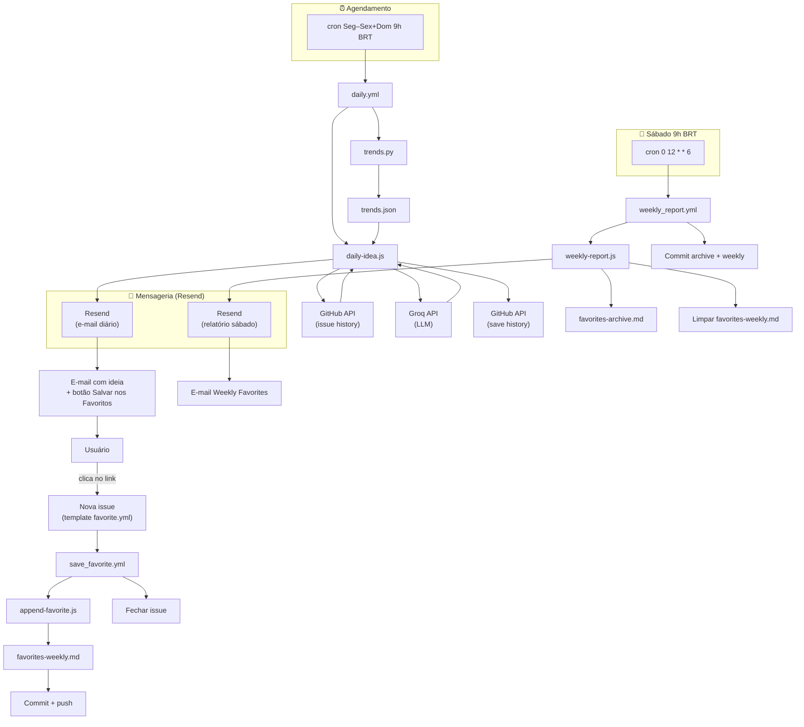

# Daily Content Idea

A system that runs daily via **GitHub Actions**, uses the **Groq API** (OpenAI-compatible) to generate a complete video idea in JSON, and emails it to you via **Resend**. Built for YouTube content strategy around dev career (BR → abroad) and frontend.

---

## What it does

1. **Mon–Fri + Sun at 9h, 9h05, 9h10, 9h15, 9h20 São Paulo (UTC-3)** — or on manual trigger — the workflow runs.
2. **Groq (LLM)** generates one full video package: type (`general_frontend` / `tech_frontend` / `general_career` / `remote_work` / `life_productivity` / `learning_growth` / `mistakes_learnings` / `tech_opinion`), title options, chosen title, thumbnail concepts, hook, outline, full script, description, tags, CTA, and “why today.”
3. **History** is stored in a single GitHub Issue (last 50 items). The prompt receives the last 10 titles/tags so the model avoids repeating similar themes.
4. **Resend** sends a formatted, readability-first HTML email with the idea.
5. **Debug artifacts** (run metadata, response preview, summary) are uploaded to the Actions run and shown in the Step Summary.

---

## Features

| Feature | Description |
|--------|-------------|
| **Cron** | Mon–Fri + Sun 9h / 9h05 / 9h10 / 9h15 / 9h20 BRT = `0,5,10,15,20 12 * * 0,1-5` UTC |
| **History** | GitHub Issue `daily-content-idea-history` as JSON storage (max 50 items, no DB) |
| **Anti-repetition** | 14-day window: types/titles/tags from last 14 days excluded; prompt gets "don't repeat" block |
| **Trends** | PyTrends → `trends.json`; prompt gets a short "real trends" block (BR/US dev keywords) |
| **Favorites** | Link in daily email → GitHub Issue (template); workflow appends to weekly, closes issue; Saturday report emails and archives |
| **Observability** | Structured JSON logs, run ID, timings (total, LLM, Resend), debug bundle, Step Summary with Trends yes/no |
| **Email** | Index with anchors, TL;DR, collapsible script/description, inline styles (Gmail-safe), "Save to Favorites" link |
| **Robust JSON** | `extractJson` (direct parse + first `{` / last `}`) + one LLM retry at lower temperature |

---

## Fluxo completo (resumo)

Do cron ao relatório semanal de favoritos, passando por e-mail, issue e changelog:



### 1. Cronjob dispara o workflow diário

- **Quando:** Seg–Sex + Dom, 9h / 9h05 / 9h10 / 9h15 / 9h20 BRT (12:00–12:20 UTC). Workflow: `.github/workflows/daily.yml`.
- **O que faz:** Faz checkout do repo, instala deps (Node + Python), roda PyTrends, depois `npm run daily` (que executa `src/daily-idea.js`).

### 2. PyTrends → `trends.json`

- **Script:** `trends.py` (Python). Roda **antes** do `daily-idea.js` no mesmo job.
- **Função:** Busca Google Trends (BR + US) para palavras do nicho DEV (react, frontend, remote work, etc.). Gera `trends.json` na raiz com `related_queries`, `related_topics` e `suggestions`.
- **Uso:** O `daily-idea.js` lê `trends.json`, monta um bloco de texto “Tendências reais DEV” e injeta no prompt da LLM para inspirar o tema do dia (sem obrigatoriedade; se falhar, o fluxo continua).

### 3. `daily-idea.js` — ideia + histórico + anti-repetição + e-mail

- **Histórico:** Lê a issue `daily-content-idea-history` (body = JSON com até 50 itens). Se não existir, cria. Cada ideia gerada é **prepended** e a lista é fatiada em 50.
- **Anti-repetição:**
  - **Janela de 14 dias:** `getRestriction14()` pega títulos, tipos e tags dos últimos 14 dias. Esses **tipos** são excluídos do sorteio do tipo do vídeo (`chooseVideoType(restriction14.types)`).
  - **Prompt:** Recebe (1) os últimos 10 títulos/tags (“do not repeat similar themes”) e (2) um bloco explícito “RESTRIÇÕES DE NÃO REPETIÇÃO” com títulos/tipos/tags dos últimos 14 dias para não repetir temas ou ângulos.
  - **Fallback:** Se todos os tipos estiverem excluídos, usa `general_career`.
- **Tipo do vídeo:** Escolhido aleatoriamente entre os tipos **não** usados nos últimos 14 dias.
- **LLM (Groq):** Gera um JSON completo (título escolhido, opções de título, thumbnail, hook, script, etc.). O prompt inclui o bloco de tendências (quando existe) e o bloco de restrições.
- **E-mail:** Monta HTML (TL;DR, índice, blocos) e envia via Resend **uma ideia por dia** (a `chosen_title` + todo o pacote). No fim do e-mail tem o link **“⭐ Salvar nos Favoritos”**.

### 4. Botão no e-mail → criar issue

- **Link no e-mail:** Aponta para `https://github.com/{owner}/{repo}/issues/new?template=favorite.yml&title=Favorite:+{chosen_title}&idea_title=...`
- **Template:** `.github/ISSUE_TEMPLATE/favorite.yml` — formulário “Save Favorite Idea” com campo *Idea title* e *Short summary*, label `favorite`.
- **Efeito:** Ao clicar, o usuário abre o formulário de nova issue já com título “Favorite: …” e título da ideia preenchido; ao submeter, uma **issue** é criada (label `favorite` ou título começando com “Favorite:”).

### 5. Workflow “Save Favorite” (issue opened)

- **Quando:** `on: issues: types: [opened]` — toda vez que uma issue é aberta.
- **Arquivo:** `.github/workflows/save_favorite.yml`.
- **Filtro:** Só segue se a issue tiver label `favorite` **ou** título começando com “Favorite:”.
- **Passos:** Checkout → `node scripts/append-favorite.js` (lê `ISSUE_TITLE`, `ISSUE_BODY`, `ISSUE_URL` do env injetado pelo workflow), que **adiciona um bloco** em `favorites/favorites-weekly.md` (título, data, link da issue, notas).
- **Commit:** `git add favorites/favorites-weekly.md` → commit “Add favorite: {título}” → push.
- **Fechamento:** Fecha a issue com `gh issue close`.

### 6. Onde os favoritos ficam salvos

- **Durante a semana:** Em `favorites/favorites-weekly.md`. Cada “Salvar nos Favoritos” gera um `## ⭐ …` com data, link da issue e notas. Esse arquivo é o “changelog” semanal de favoritos (atualizado por commit no `save_favorite.yml`).
- **Arquivamento:** No sábado o `weekly_report.yml` roda e o `weekly-report.js` lê `favorites-weekly.md`, envia o e-mail “Weekly Favorites Report”, **anexa** o conteúdo da semana em `favorites/favorites-archive.md` (com cabeçalho “Week of YYYY-MM-DD”) e **limpa** o `favorites-weekly.md` (deixa só o cabeçalho). O commit “Weekly favorites: archive and clear weekly” persiste archive + weekly no repositório.

### 7. Sábado: e-mail dos favoritos da semana

- **Cron:** `0 12 * * 6` (sábado 12:00 UTC = 9h BRT). Workflow: `.github/workflows/weekly_report.yml`.
- **Script:** `scripts/weekly-report.js`. Lê `favorites-weekly.md`; se houver favoritos (blocos `## ⭐`), envia e-mail via Resend com o corpo do weekly, depois anexa no archive e limpa o weekly; por fim o workflow faz o commit de `favorites/`.

**Resumo anti-repetição:** (1) tipos usados nos últimos 14 dias não entram no sorteio do tipo; (2) últimos 10 títulos/tags + bloco “RESTRIÇÕES” dos últimos 14 dias no prompt para o modelo não repetir temas/ângulos; (3) fallback de tipo se tudo estiver excluído.

---

## Requirements

- **Node.js 20+**
- **Env vars** (see below)
- **Groq API key** — [console.groq.com](https://console.groq.com)
- **Resend API key** — [resend.com](https://resend.com) (e.g. `onboarding@resend.dev` for testing)

---

## Setup

### 1. GitHub Actions secrets

In the repo: **Settings → Secrets and variables → Actions**, add:

| Secret | Required | Description |
|--------|----------|-------------|
| `GROQ_API_KEY` | Yes | Groq API key |
| `RESEND_API_KEY` | Yes | Resend API key |
| `EMAIL_TO` | Yes | Email that receives the idea |
| `EMAIL_FROM` | Yes | Sender (must be a verified domain in Resend, or e.g. `onboarding@resend.dev`) |
| `GROQ_MODEL` | No | Default: `llama-3.3-70b-versatile` |

`GITHUB_TOKEN` and `GITHUB_REPOSITORY` are set automatically by the workflow (no need to create them).

### 2. Local development

Clone and install:

```bash
git clone <repo-url>
cd ai_video_content_secretary
npm install
```

Set env vars (optional: add `GITHUB_TOKEN` + `GITHUB_REPOSITORY` to enable history):

```bash
export GROQ_API_KEY="your-groq-key"
export RESEND_API_KEY="your-resend-key"
export EMAIL_TO="you@example.com"
export EMAIL_FROM="Ideas <onboarding@resend.dev>"
# Optional: for history (issue read/write)
export GITHUB_TOKEN="ghp_..."
export GITHUB_REPOSITORY="owner/repo"
```

Run once:

```bash
npm run daily
```

---

## Project structure

```
.
├── .github/
│   ├── ISSUE_TEMPLATE/
│   │   └── favorite.yml   # "Save Favorite Idea" form (idea_title, summary)
│   └── workflows/
│       ├── daily.yml      # Mon–Fri + Sun 12:00/12:05/12:10/12:15/12:20 UTC; PyTrends; npm run daily; debug artifacts
│       ├── save_favorite.yml   # On issue opened (label/title "Favorite: ...") → append weekly, close issue
│       └── weekly_report.yml  # Saturday 12:00 UTC; email weekly favorites, archive, clear weekly
├── favorites/
│   ├── favorites-weekly.md   # Current week favorites (appended by save_favorite)
│   └── favorites-archive.md # Past weeks (appended by weekly_report)
├── scripts/
│   ├── append-favorite.js   # Parses issue body, appends to favorites-weekly.md
│   └── weekly-report.js      # Sends Resend email, appends to archive, clears weekly
├── src/
│   └── daily-idea.js      # Main: Groq, history, trends, Resend, debug bundle, extractJson
├── trends.py              # Fetches Google Trends (BR/US) for dev keywords → trends.json
├── debug/                 # Generated at runtime (.gitignore)
│   ├── last-run.json
│   ├── last-response-preview.txt
│   ├── last-payload.json
│   ├── summary.md
│   └── trends-preview.json
├── package.json
└── README.md
```

---

## Running

### On schedule

The workflow runs **Mon–Fri + Sun at 12:00, 12:05, 12:10, 12:15, 12:20 UTC** (9h, 9h05, 9h10, 9h15, 9h20 São Paulo).

### Manual run

1. **Actions** → **Daily Content Idea** → **Run workflow** → **Run workflow**.

### Locally

```bash
npm run daily
```

If `GITHUB_TOKEN` or `GITHUB_REPOSITORY` is missing, the script still runs but skips loading/saving history (logs `history_skip`).

---

## History (GitHub Issue)

- **Issue title:** `daily-content-idea-history`
- **Body:** JSON only, e.g.:

```json
{
  "version": 1,
  "items": [
    {
      "ts": "2025-01-31T12:00:00.000Z",
      "video_type": "general_career",
      "chosen_title": "...",
      "tags": ["carreira", "..."],
      "hook": "...",
      "why_today": "..."
    }
  ]
}
```

- New idea is **prepended**; list is **sliced to 50**.
- If the issue doesn’t exist, it is created. If the body is invalid JSON, it is re-initialized with `{ "version": 1, "items": [] }`.

---

## Debug and observability

- **Structured logs:** One JSON line per event (`logInfo` / `logWarn` / `logError`). No secrets; only env var names (present/absent).
- **Run ID:** Unique per run (timestamp + random) for correlating logs and artifacts.
- **Timings:** `totalMs`, `llmMs`, `resendMs` in `debug/last-run.json`.
- **Artifacts:** The workflow uploads the `debug/` folder as **debug-artifacts** (on success or failure).
- **Step Summary:** Content of `debug/summary.md` is appended to the job’s Step Summary in the Actions UI.

---

## Video types

- **Selection:** Random, with 14-day anti-repetition: types (and related titles/tags) from the last 14 days are excluded; one type is chosen uniformly from the remaining.
- **Fallback:** If all types are excluded or none available, `general_career` is used.
- **Valid types:** `general_frontend`, `tech_frontend`, `general_career`, `remote_work`, `life_productivity`, `learning_growth`, `mistakes_learnings`, `tech_opinion`.

---

## License

Private / use as you like.
